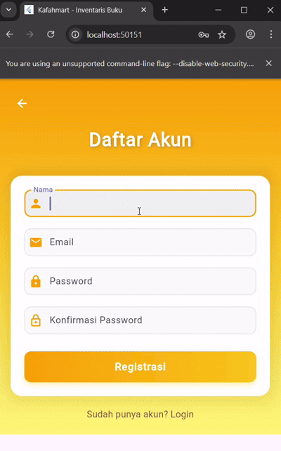

# Kafahmart - Sistem Inventaris Buku 📚

<div align="center">
  
</div>

## 📋 Informasi Mahasiswa

| Field | Keterangan |
|-------|-----------|
| **Nama** | Nadzare Kafah Alfatiha |
| **NIM** | H1D023014 |
| **Shift Lama** | Shift A |
| **Shift Baru** | Shift F |
| **Mata Kuliah** | Pemrograman Mobile - Responsi 2 Paket 3 |

---

## 📖 Deskripsi Aplikasi

**Kafahmart** adalah aplikasi mobile berbasis Flutter untuk mengelola inventaris buku. Aplikasi ini menyediakan fitur CRUD (Create, Read, Update, Delete) lengkap dengan sistem autentikasi pengguna. Aplikasi ini terhubung dengan REST API backend yang dibangun menggunakan CodeIgniter 4.

### ✨ Fitur Utama

- 🔐 **Autentikasi Pengguna**: Login dan Registrasi
- 📚 **Manajemen Buku**: Tambah, Lihat, Edit, dan Hapus data buku
- 🎨 **UI/UX Modern**: Desain dengan gradient amber yang elegan
- 🔄 **Real-time Update**: Refresh data otomatis setelah operasi CRUD
- 💾 **Session Management**: Penyimpanan token menggunakan SharedPreferences
- ⚡ **Responsive**: Tampilan yang optimal di berbagai ukuran layar

---

## 🏗️ Arsitektur Aplikasi

### Struktur Folder

```
lib/
├── main.dart                 # Entry point aplikasi
├── helpers/
│   ├── api_url.dart         # Konfigurasi endpoint API
│   └── user_info.dart       # Helper untuk manajemen session user
├── models/
│   └── buku.dart            # Model data buku
└── ui/
    ├── login_page.dart      # Halaman login
    ├── registrasi_page.dart # Halaman registrasi
    ├── buku_page.dart       # Halaman daftar buku (list)
    ├── buku_form.dart       # Halaman form tambah/edit buku
    └── buku_detail.dart     # Halaman detail buku
```

---

## 🔌 Spesifikasi API

### Base URL
```
http://192.168.100.13:8080
```

### Endpoints yang Digunakan

| Method | Endpoint | Fungsi | Autentikasi |
|--------|----------|--------|-------------|
| POST | `/register` | Registrasi user baru | ❌ |
| POST | `/login` | Login user | ❌ |
| GET | `/books` | Mengambil semua data buku | ✅ |
| POST | `/books` | Menambah buku baru | ✅ |
| GET | `/books/{id}` | Mengambil detail buku | ✅ |
| PUT | `/books/{id}` | Mengupdate data buku | ✅ |
| DELETE | `/books/{id}` | Menghapus data buku | ✅ |

### Format Response API

#### Success Response (List Buku)
```json
{
  "status": true,
  "data": [
    {
      "id": 1,
      "judul": "Pemrograman Flutter",
      "penulis": "John Doe",
      "penerbit": "Tech Publisher",
      "harga": 150000,
      "jumlah": 10,
      "volume": "1",
      "tanggal_masuk": "2024-01-15"
    }
  ]
}
```

#### Error Response
```json
{
  "status": false,
  "message": "Error message here"
}
```

---

## 📱 Penjelasan Fungsi dan Integrasi API

### 1. **Autentikasi (Login & Registrasi)**

#### **Login (`login_page.dart`)**

**Fungsi:**
- Memvalidasi email dan password pengguna
- Mengirim kredensial ke API endpoint `/login`
- Menyimpan token autentikasi ke local storage menggunakan `SharedPreferences`
- Navigasi otomatis ke halaman utama setelah login berhasil

**Integrasi API:**
```dart
Future<void> _submit() async {
  final response = await http.post(
    Uri.parse(ApiUrl.login),
    body: {
      'email': _emailTextboxController.text,
      'password': _passwordTextboxController.text
    }
  );
  
  var data = json.decode(response.body);
  if (data['status'] == true) {
    await UserInfo().setToken(data['token']);
    await UserInfo().setUserID(data['user_id']);
    // Navigate to BukuPage
  }
}
```

**Flow:**
1. User mengisi form email dan password
2. Validasi input di client-side
3. Kirim POST request ke `/login`
4. API memverifikasi kredensial
5. Jika valid, API mengirim token
6. Token disimpan di SharedPreferences
7. Redirect ke halaman daftar buku

---

#### **Registrasi (`registrasi_page.dart`)**

**Fungsi:**
- Memvalidasi data registrasi (nama, email, password, konfirmasi password)
- Mengirim data registrasi ke API endpoint `/register`
- Menampilkan notifikasi sukses/gagal
- Navigasi ke halaman login setelah registrasi berhasil

**Integrasi API:**
```dart
Future<void> _submit() async {
  final response = await http.post(
    Uri.parse(ApiUrl.registrasi),
    body: {
      'nama': _namaTextboxController.text,
      'email': _emailTextboxController.text,
      'password': _passwordTextboxController.text
    }
  );
  
  var data = json.decode(response.body);
  if (data['status'] == true) {
    // Navigate to LoginPage
  }
}
```

**Validasi:**
- Email harus format valid
- Password minimal 6 karakter
- Password dan konfirmasi password harus sama

---

### 2. **Manajemen Data Buku**

#### **Daftar Buku (`buku_page.dart`)**

**Fungsi:**
- Menampilkan semua data buku dalam bentuk list card
- Pull-to-refresh untuk update data
- Navigasi ke halaman detail, tambah, dan edit
- Logout functionality

**Integrasi API:**
```dart
Future<void> getData() async {
  String? token = await UserInfo().getToken();
  final response = await http.get(
    Uri.parse(ApiUrl.listBuku),
    headers: {
      'Content-Type': 'application/json',
      'Authorization': 'Bearer $token'
    }
  );
  
  if (response.statusCode == 200) {
    var data = json.decode(response.body);
    setState(() {
      listBuku = data['data'].map((json) => Buku.fromJson(json)).toList();
    });
  }
}
```

**Fitur:**
- Loading indicator saat fetch data
- Empty state jika tidak ada data
- Card design yang informatif
- Floating action button untuk tambah buku

---

#### **Detail Buku (`buku_detail.dart`)**

**Fungsi:**
- Menampilkan informasi lengkap sebuah buku
- Tombol Edit untuk mengubah data
- Tombol Delete dengan konfirmasi dialog
- Navigasi kembali ke list setelah operasi

**Delete Integrasi API:**
```dart
Future<void> _deleteBuku() async {
  String? token = await UserInfo().getToken();
  final response = await http.delete(
    Uri.parse(ApiUrl.deleteBuku(widget.buku.id!)),
    headers: {
      'Content-Type': 'application/json',
      'Authorization': 'Bearer $token'
    }
  );
  
  if (response.statusCode == 200) {
    Navigator.pop(context, true); // Kembali ke list dengan refresh
  }
}
```

**Informasi yang Ditampilkan:**
- Judul Buku
- Penulis
- Penerbit
- Harga
- Jumlah Stok
- Volume
- Tanggal Masuk

---

#### **Form Buku (`buku_form.dart`)**

**Fungsi:**
- Form untuk menambah buku baru (mode CREATE)
- Form untuk mengedit buku existing (mode UPDATE)
- Validasi input sebelum submit
- Auto-fill data saat mode edit

**Create - Integrasi API:**
```dart
Future<void> simpan() async {
  String? token = await UserInfo().getToken();
  final response = await http.post(
    Uri.parse(ApiUrl.createBuku),
    headers: {
      'Content-Type': 'application/json',
      'Authorization': 'Bearer $token'
    },
    body: json.encode({
      'judul': _judulTextboxController.text,
      'penulis': _penulisTextboxController.text,
      'penerbit': _penerbitTextboxController.text,
      'harga': int.parse(_hargaTextboxController.text),
      'jumlah': int.parse(_jumlahTextboxController.text),
      'volume': _volumeTextboxController.text,
      'tanggal_masuk': _tanggalMasukTextboxController.text
    })
  );
}
```

**Update - Integrasi API:**
```dart
Future<void> ubah() async {
  String? token = await UserInfo().getToken();
  final response = await http.put(
    Uri.parse(ApiUrl.updateBuku(widget.buku!.id!)),
    headers: {
      'Content-Type': 'application/json',
      'Authorization': 'Bearer $token'
    },
    body: json.encode({
      // data buku yang diupdate
    })
  );
}
```

**Field Form:**
- Judul Buku (required)
- Penulis (required)
- Penerbit (required)
- Harga (required, numeric)
- Jumlah Stok (required, numeric)
- Volume (required)
- Tanggal Masuk (required, date picker)

---

### 3. **Helper Classes**

#### **ApiUrl (`helpers/api_url.dart`)**

**Fungsi:**
- Centralized API endpoint configuration
- Mempermudah maintenance dan perubahan base URL
- Type-safe URL generation dengan parameter

```dart
class ApiUrl {
  static const String baseUrl = 'http://192.168.100.13:8080';
  static const String registrasi = '$baseUrl/register';
  static const String login = '$baseUrl/login';
  static const String listBuku = '$baseUrl/books';
  static const String createBuku = '$baseUrl/books';
  
  static String updateBuku(int id) => '$baseUrl/books/$id';
  static String showBuku(int id) => '$baseUrl/books/$id';
  static String deleteBuku(int id) => '$baseUrl/books/$id';
}
```

---

#### **UserInfo (`helpers/user_info.dart`)**

**Fungsi:**
- Manajemen session pengguna
- Menyimpan dan mengambil token autentikasi
- Menyimpan dan mengambil user ID
- Fungsi logout untuk clear session

```dart
class UserInfo {
  Future<void> setToken(String token) async {
    SharedPreferences pref = await SharedPreferences.getInstance();
    await pref.setString('token', token);
  }
  
  Future<String?> getToken() async {
    SharedPreferences pref = await SharedPreferences.getInstance();
    return pref.getString('token');
  }
  
  Future<void> logout() async {
    SharedPreferences pref = await SharedPreferences.getInstance();
    await pref.clear();
  }
}
```

---

### 4. **Model Data**

#### **Buku Model (`models/buku.dart`)**

**Fungsi:**
- Representasi struktur data buku
- Parsing JSON dari API ke objek Dart
- Type-safe data handling

```dart
class Buku {
  int? id;
  String? judul;
  int? harga;
  int? jumlah;
  String? tanggalMasuk;
  String? volume;
  String? penulis;
  String? penerbit;

  factory Buku.fromJson(Map<String, dynamic> obj) {
    return Buku(
      id: obj['id'],
      judul: obj['judul'],
      harga: obj['harga'],
      jumlah: obj['jumlah'],
      tanggalMasuk: obj['tanggal_masuk'],
      volume: obj['volume']?.toString(),
      penulis: obj['penulis'],
      penerbit: obj['penerbit'],
    );
  }
}
```

---

## 🔄 Flow Aplikasi

### 1. **Authentication Flow**
```
Splash Screen → Check Token
                  ↓
        Token Valid? 
        ↓           ↓
       Yes          No
        ↓           ↓
    Buku Page   Login Page
                    ↓
              [Login/Register]
                    ↓
              Save Token → Buku Page
```

### 2. **CRUD Flow**
```
Buku Page (List)
    ↓
    ├─→ [+] Tambah → Form (Create) → POST /books → Refresh List
    ├─→ [Card] Tap → Detail Page
    │                    ↓
    │              ├─→ [Edit] → Form (Update) → PUT /books/{id} → Refresh
    │              └─→ [Delete] → Confirm → DELETE /books/{id} → Back to List
    └─→ [Refresh] → GET /books → Update List
```

---

## 🛠️ Teknologi yang Digunakan

### Frontend (Flutter)
- **Framework**: Flutter 3.9.2
- **Language**: Dart
- **State Management**: setState (StatefulWidget)
- **HTTP Client**: http ^1.1.0
- **Local Storage**: shared_preferences ^2.2.2

### Backend
- **Framework**: CodeIgniter 4
- **Database**: MySQL
- **Authentication**: Token-based (Bearer Token)

### Dependencies
```yaml
dependencies:
  flutter:
    sdk: flutter
  cupertino_icons: ^1.0.8
  http: ^1.1.0
  shared_preferences: ^2.2.2
```

---

## 🚀 Cara Menjalankan Aplikasi

### Prerequisites
- Flutter SDK (3.9.2 atau lebih baru)
- Android Studio / VS Code
- Emulator Android / iOS atau Device fisik
- Backend API yang sudah berjalan

### Langkah Instalasi

1. **Clone Repository**
   ```bash
   git clone https://github.com/Nadzare/responsi-2-mobile-h1d023014.git
   cd responsi-2-mobile-h1d023014
   ```

2. **Install Dependencies**
   ```bash
   flutter pub get
   ```

3. **Konfigurasi API URL**
   
   Edit file `lib/helpers/api_url.dart`:
   ```dart
   static const String baseUrl = 'http://YOUR_IP:8080';
   ```
   
   Ganti `YOUR_IP` dengan IP address komputer yang menjalankan backend API.

4. **Run Aplikasi**
   ```bash
   flutter run
   ```

### Testing
```bash
flutter test
```

---

## 📦 Resources

### Repository & Dokumentasi

| Resource | Link |
|----------|------|
| **Repository Frontend** | [responsi-2-mobile-h1d023014](https://github.com/Nadzare/responsi-2-mobile-h1d023014) |
| **Repository Backend API** | [kafahmart-api-ci](https://github.com/Nadzare/kafahmart-api-ci) |
| **Database Export** | [Google Drive](https://drive.google.com/drive/folders/1l0mx0TS5ARjG-3gOUPwaV2Cc7dnHO52b?usp=sharing) |

---

## 📸 Screenshot Aplikasi

### Splash Screen & Authentication
- Splash screen dengan logo Kafahmart
- Login page dengan validasi
- Registrasi page dengan konfirmasi password

### Main Features
- List buku dengan card design
- Detail buku lengkap dengan informasi
- Form tambah/edit buku dengan validasi
- Konfirmasi dialog untuk delete

### UI/UX Features
- Gradient theme amber yang konsisten
- Loading indicator untuk async operations
- Empty state untuk list kosong
- Pull-to-refresh functionality
- Smooth navigation transitions

---

## 👨‍💻 Developer

**Nadzare Kafah Alfatiha**
- NIM: H1D023014
- Email: [contact@example.com]
- GitHub: [@Nadzare](https://github.com/Nadzare)

---

## 📄 License

This project is created for academic purposes as part of Mobile Programming course assignment.

---

## 🙏 Acknowledgments

- Dosen Pengampu: Pemrograman Mobile
- Universitas Jenderal Soedirman
- Flutter Documentation
- CodeIgniter 4 Documentation

---

<div align="center">
  <p>Made with ❤️ by Nadzare Kafah Alfatiha</p>
  <p>© 2024 Kafahmart - All Rights Reserved</p>
</div>
